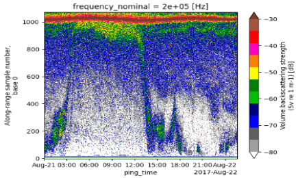

[](https://github.com/uw-echospace/ooi-workflow/blob/main/LICENSE)
# Ocean Sonar Data Workflow
#### Data 591 – Capstone Project
##### Sagnik Ghosal, Prerit Chaudhary, Ishank Vasania (Sponsor: Applied Physics Lab, eScience Institute)

## 1. Introduction
The ocean, covering over 70% of the Earth's surface, represents a vast and rich ecosystem. Recent advancements in oceanography, particularly in technological innovations, have significantly enhanced our ability to explore and understand this immense body of water. Among the remarkable tools at our disposal is the echosounder, which emits sound waves into the ocean and captures the echoes rebounding from underwater objects, as depicted in Figure 1. Through the analysis of these echoes on computer systems, researchers can glean insights into various aspects of the ocean, such as animal habitats, seabed topography, and water movement patterns. 
Utilizing echosounders for oceanic data collection holds paramount importance for both the study of marine life and the ocean itself. This technology enables scientists to discern crucial information, including fish population densities and the characterization of underwater habitats. However, a notable challenge arises from the sheer volume and complexity of data generated by echosounders. Current data processing systems, while adept at data acquisition, often struggle to efficiently handle and extract meaningful insights from the vast datasets. Therefore, researchers face difficulties in effectively interpreting oceanic data, hindering advancements in marine conservation and fisheries management.

## 2. Problem Statement
The extensive ocean sonar data obtained from echosounders presents a significant challenge due to its intricate processing requirements. Furthermore, the integration of diverse data sources adds complexity to the analysis process. A specialized pipeline capable of efficiently ingesting data and conducting analysis is crucial for effective sonar data processing and visualization. 

## 3. Proposed Solution
Our proposed solution entails the development of a streamlined workflow tailored to address the challenges associated with handling and processing large volumes of ocean sonar data. This workflow aims to transform raw instrument-generated files into higher-level ARCO ("analysis ready, cloud-hosted") datasets, facilitating marine ecological and fisheries analysis. Leveraging existing software libraries such as Echopype and Echoshader, we will construct a robust data pipeline and visualization tools. Additionally, we plan to make the visualizations interactive, thereby making exploration of ocean sonar data intuitive.


## 4. Methodology
In this study, we developed a workflow for ocean sonar data processing and visualization using [Echopype](https://github.com/OSOceanAcoustics/echopype) and [Echoshader](https://github.com/OSOceanAcoustics/echoshader) libraries. Echopype streamlines data analysis with scalable computations, while Echoshader provides interactive visualization tools. Leveraging Dask for handling large datasets, our pipeline aims to efficiently ingest, preprocess, and visualize oceanic data, fostering clearer insights into marine environments.

### 4.1. Open-source tools and libraries
In our study, we aim to develop a streamlined workflow for processing and visualizing ocean sonar data. To achieve this goal, we utilize existing open-source tools and libraries, namely Echopype and Echoshader, to transform raw sonar data into analysis-ready datasets and create interactive visualizations. 
- Echopype addresses the underutilization of ocean sonar data by adopting an interoperable NetCDF format, facilitating scalable computations through Xarray and Dask for efficient analysis and dataset integration. While Echopype provides robust functionality, adapting its source code may be necessary to overcome existing limitations.
- Echoshader complements Echopype's processing capabilities with interactive visualization tools. Leveraging the HoloViz suite, Echoshader offers customizable features for exploring echo data, contributing to standardization, preprocessing, and data organization efforts.
- Additionally, we utilize Dask, a parallel and distributed computing library, to optimize handling of large datasets across single machines and clusters. With advanced parallelism and task scheduling capabilities, Dask seamlessly integrates with Python libraries, enhancing data processing performance for our workflow.
 

### 4.2. Pipeline Development
We have developed a comprehensive pipeline to streamline the process of data ingestion, preprocessing, and visualization. The pipeline begins by taking in the Raw Data URL covering multiple years. Using the Echopype library, the pipeline performs several key tasks: data ingestion retrieves raw data files for each day within the specified period, data conversion transforms raw data files into echodata objects, and data processing includes cleaning, filtering, and aggregating the data. Finally, all echodata objects are consolidated into a single echodata object. In the subsequent stage of the pipeline, the Echoshader library is employed to create interactive visualizations. Users are provided with options to display visualizations for specific days, spanning across months, or for an entire year, enhancing accessibility and user experience. 

### 4.3. Data Acquisition
The echosounder data, amounting to terabytes, is obtained from the NSF Ocean Observatories Initiative (OOI) dating back to 2014. This vast dataset is stored using an Apache file system. It encompasses time-series ocean data across various domains, including the Air-Sea Interface, Seafloor/Crust, and Water Column. The data is accessible in two main formats: Processed Datasets in NetCDF format and JSON format. These formats facilitate easy access and compatibility with a range of analysis tools and software environments. The data acquisition process begins by defining the URL for raw data retrieval from the Ocean Observatories Initiative (OOI) platform. We establish a function to handle exceptions during parsing, ensuring robust error handling. First, we check if the file URL falls within the specified datetime range. Then, using a loop, we generate URLs for each day within the desired period.

### 4.4. Data Preprocessing
Once we generate the URL for each day within the given period in the data acquisition step, we then retrieve all raw file URLs and filter them based on the specified datetime range, resulting in a list of desired raw file URLs. Each raw file URL is processed using a helper function which opens and saves the raw file data (in program memory and not physically on the system), employing the Echopype library. This function also handles any exceptions encountered during the process. Subsequently, we create a list of Echodata objects and their corresponding paths, leveraging Dask for parallel computing. The data is organized into a data frame for each year, enabling efficient processing and visualization. The pipeline iterates through each year, combining Echodata objects with identical channels into single objects. Finally, the processed data is stored in a dictionary for vizualization. 


## 5. Results
### 5.1. Major Improvements and Outcomes
1. We have successfully implemented a data pipeline designed for ingestion, processing, and visualization, streamlining the entire process for users as illustrated in Figure 2. This automation simplifies the workflow, requiring users only to input the data URL, with the subsequent steps being handled seamlessly. The pipeline culminates in an interactive visualization, relieving researchers from the burden of coding solutions to manage vast amounts of ocean data. Instead, they can effortlessly input the data URL and access visualizations, enabling them to focus more on ocean research.


2. Moreover, we have significantly optimized memory usage by eliminating the need to store extracted raw files physically on the system. Previously, the extraction process required substantial memory (~100GB) to store .Zarr files. With our pipeline, we have removed this redundancy by storing the raw files in the program memory, leading to a notable reduction in memory requirements.

3. Furthermore, we have enhanced processing capacity by ~28 times through Dask optimization. While the previous implementation could only process one day of raw data, our pipeline can now handle up to 1400 raw data files, significantly expanding processing capabilities.


4. Additionally, the processing time for raw files has been reduced by ~15 times with Dask optimization. Whereas standard Python libraries could process only about 50 raw files, taking close to 3 hours, Dask enables processing of 1400 files within 30 minutes.


5. Finally, we have introduced interactive visualization features at the pipeline's end, enabling users to explore single as well as multi-day, week, and month visualizations interactively.




 

### 5.2. Some Additional Interesting Findings
1. During our analysis, we encountered issues with data consistency resulting from instrument changes, impacting the integrity of raw data sources. These discrepancies led to pipeline failures, prompting us to segregate data post-2019 and utilize earlier data to develop the pipeline effectively. 

2. Furthermore, we identified discrepancies in the data fetching process from the provided raw URL. Initially, regardless of the specified date, the code retrieved only a limited number of files, typically 20 to 30. Upon closer examination, we noticed that while the code returned the expected number of files for a single day, it failed to retrieve the appropriate number when extended to a monthly range. After identifying errors in the data fetching logic, we rectified the process to ensure accurate file retrieval for any given time range.  

3. In our experimentation with the Dask library across different operating systems, we observed seamless functionality on Mac systems but encountered issues with Windows compatibility. Further investigation revealed that while our implementation was correct, Windows' handling of multiprocessing differed from that of Mac and Linux, resulting in operational challenges when executing Dask code on Windows machines.  

4. Additionally, we explored alternative parallel processing strategies using standard Python libraries on both Windows and Mac platforms. However, comparative analysis revealed that Dask consistently outperformed these methods, demonstrating superior performance across various tasks.


## Challenges Faced
1. Time-Taking Process - We experienced considerable difficulties throughout the raw data translation procedure, which required significant time and processing resources. Converting raw files to processed files proved time-consuming. To overcome this issue, we implemented Dask parallel processing, which is described in the 'Performance Improvement' section.

2. Lack of Data Consistency - Data consistency became a serious challenge as a result of the many data collection sources and frequent sensor changes. While there was considerable consistency in data between 2016 and 2019, with sensor upgrades occurring twice a year, data consistency deteriorated significantly after 2019. We had difficulty merging Echopype data due to irregularities in sensor channels. In addition, modifications to the raw data format occurred after 2019, complicating the data integration procedure.

3. Scaling Challenges - Scaling the program proved problematic, especially given Dask's compatibility limitations across several operating systems. Dask ran smoothly on macOS, but it had compatibility concerns on Windows and Ubuntu. To address these issues, we designed batch processing and created recursive functions for easier data combining and processing.

4. Conda Environment Creation and Update Issues - We encountered difficulties with generating and updating Conda environments, mainly due to the length of time it required to accomplish these tasks. The construction and update of Conda environments proved time-consuming, reducing the productivity of our development approach. This issue adds complexity to our project management and development duties, necessitating more time and resources to resolve.

5. Lack of Storage and Computational Resources - Our research encountered substantial resource limits, particularly in terms of storage and computational capacity. The sheer volume of data, which exceeded 1 TB, presented storage capacity constraints for both downloading and processing. Furthermore, due to the nature of the data processing activities, all computations were conducted in RAM, limiting the available memory. To solve these limits, we acquired a Jetstream virtual machine with more than 200 GB of RAM, allowing for speedier computing. However, the system only provided 350 GB of storage, which was insufficient for our data processing needs. To circumvent this issue, we created a method that involved mounting more virtual storage, so increasing our storage capacity to fit the enormous dataset.

## Reproducing the Analysis
To reproduce this analysis, follow these steps (for both Mac and Windows):
1. If you are running this project/code for the first time, please clone this repository and open command prompt (for Mac) and anaconda command prompt (for Windows)
If you have previously ran the code, and want to update the environment, with the modified dependencies, please run: ```conda env update -n echopype -f environment.yml```.
Otherwise, run the following command to get the required environment setup on your system: ```conda env create -f environment.yml```
2. Next, activate the environment, by running the following command: ```conda activate echopype```
3. Inside the activated environment, check if Jupyter is installed in the environment by running the following command:
```conda list jupyter```
If nothing or an error shows up, it means that Jupyter is not installed. Please install jupyter by executing the following command before proceeding ahead:
```conda install -c conda-forge jupyter```. 
If the Jupyter versions show up upon running the command, it means that Jupyter is already installed in the environment, and you may choose to skip this step.
4. Finally, start the program, by executing the following: ```conda run -n echopype jupyter notebook```


## Best Documentation Practices
- PEP 8 – Style Guide for Python Code ([Reference link](https://peps.python.org/pep-0008/))
- Use of relative path addresses to help in reproducibility
- Use of intuitive variable and function names to ease in understanding
- Appropriate comments and documentation provided for the data aquisition, data processing and data analysis steps
- Description of all data files present in the repository mentioned
